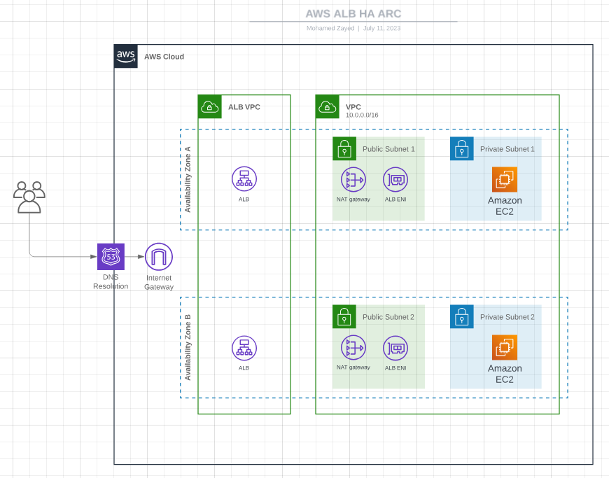

# Terraform aws boilerplate

This project uses Terraform to spin up resources in AWS

## Architecture

### Install terraform

```bash
go install github.com/hashicorp/terraform@latest
```

### Setup the terraform cli

```
terraform login
terraform workspace select stg
```

### Initialize this terraform project

```bash
terraform init
```

### Run your first terraform plan

```
terraform plan
```

## Project structure

```
+-- config/               - global yaml driven configuration to promote reuse elsewhere in the code
+-- modules/              - all custom terraform modules that enable us to easily spin up our AWS infrastructure
|   +-- _infrastructure/  - contains the main module that will create our infrastructure
|   +-- */                - other specific AWS resource modules
+-- _config.tf            - terraform provider configuration
+-- _data.tf              - terraform global data
+-- _locals.tf            - local variables generated from the config/ yaml files
+-- main.tf               - the entrypoint to this terraform module
+-- variables.tf          - variables that are defined inside the terraform cloud workspace
```
